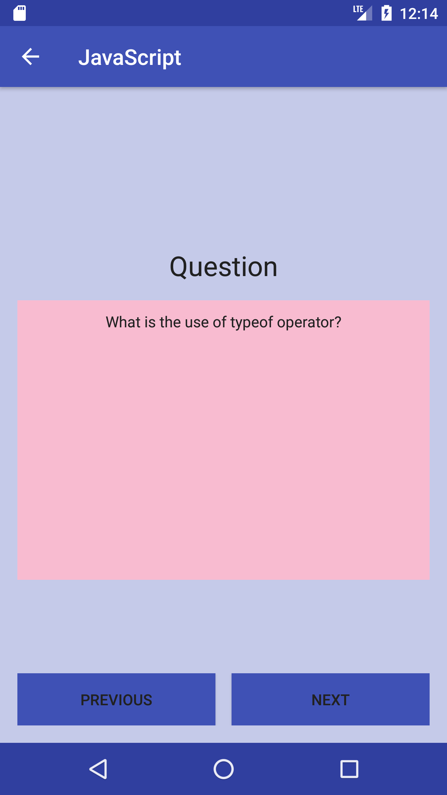

#### By _**Yusuf Qedan**_

## Description
*	This is an Android application that will help software developers prepare for job interviews.
*	This application includes flashcards to drill the user and multiple choice questions to test knowledge.
*	Users can create their own flashcards as well so they can study whatever topic they want
*	Technologies Used: Android, Java and Firebase

## Setup/Installation Requirements
* Clone this repository
* Open Android Studio and open an existing project.
* Android Studio 2.3 is required for best results. If using 2.2 or older you will need to disable instant run in Settings(Preferences on Mac) -> Build, Execution, and Deployment -> Instant Run and uncheck all of the Boxes. Next click Build -> Clean Project.

## Screenshots

## Known Bugs
_None_

## Support and contact details
_Any issues email me at yusuf9191@gmail.com_

## Technologies Used
_Android, Java_

### License
*This software is licensed under the MIT license*

Copyright (c) 2017 **_Yusuf Qedan_**
